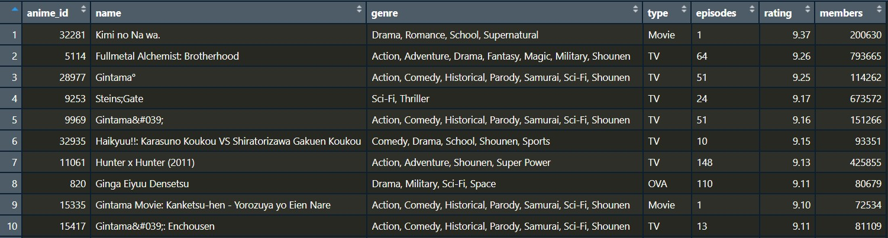

```{r setup, include=FALSE}
library(htmlwidgets)
library(IRdisplay)
library(ggplot2)
library(plotly)
knitr::opts_chunk$set(echo = FALSE, warning = FALSE, message = FALSE)
```


#### **Introduction:**

I have been watching anime for many years, it started with ***Accel World*** and ***Nanatsu No Taizai*** on Animax( which has ceased broadcasting in India). I personally think that the anime community has come a long way from lousy animations to one of the best animated projects ever. So, I have analysed some trends based on the available dataset.


Anime has been very popular since a long time, especially due to their deep storylines and the bond it creates between you and the character.
I will be using the [Anime Recommendations Database](https://www.kaggle.com/datasets/CooperUnion/anime-recommendations-database?select=anime.csv)(Which has user ratings from the famous website [**MyAnimeList**](https://myanimelist.net/)( MAL)) dataset which is available on kaggle publically for performing this analysis.
I thoght of scrapping from mal but in [Terms of Use Agreement](https://myanimelist.net/about/terms_of_use) under "User Content" last para it was mentioned that scraping was not allowed without prior consent.

This data set contains information on 12,294 anime. The ratings are on a scale of 1 to 10.
Top 10 enteries being the following:



* **anime_id** : Unique id for identifying a particular anime.
* **name**: Name of the anime
* **genre**: Genre that the anime falls under
* **type**: How it was aired (ex: TV, movie, OVA, ONA, special)
* **episodes**: number of episodes in that anime
* **rating**: average rating out of 10 for this anime, provided by the website provider.
* **members**: number of community members that follow the particular anime.
For the sake of simplicity members can be considered as number of users who voted for that anime.

I will also be scraping ratings from imdb to comapre it with mal to see is there any relation between the two or is one more prefered than the other?

#### **Data Scrapping**

For data scraping we used the famous imdb website to get ratings and votes of top animes.

* Even though the names appeared in english on website, when scrapped some were in **romaji**( a system of romanized spelling used to transliterate Japanese)
* Some titles were without any ratings( as they were not released globally but available only in Japan), so had to remove them manually.
* While scraping number of votessome extra enteries were also coming which turned out to be box office money it made (in case of the anime movie), so to remove them I used "grepl" fuction to remove all enteries having "," in them.
* Scrapped only 5-6 pages as after that many animes were not even rated.(So are scrapped data had a selection bias)

Then created a dataframe with names, ratings and votes, and saved it as a Rdata object. 


#### **Data Preparation and Cleaning from Kaggle dataset:**

Apart from Null values, there was not much data cleaning to be done for this dataset. But, since the data was extracted directly from the website, the names of the anime where not in the proper format.
```{r  echo=FALSE}
dat2 <- read.csv("anime_2.csv")
dat2[1:5, 2]
```
Some were having special characters, while some were in romaji.
Which made comparision between imdb ratings and mal ratings very inaccurate.

So to improve this I took another dataset from kaggle which had anime ratings from [Anime Planet](https://www.anime-planet.com) having around 18500 anime titles and 17 col names:
```{r }
dat <- read.csv("Anime.csv")
colnames(dat)
```
Of which took only the 2, 3, 6, 10 columns.

Then I used "which(  %in%  )" to identify common titles between names of mal dataset and english names of anime planet dataset, and similarly did the same between mal and japanese names of anime planet.

On the basis of indexes I got from above, I created a new combined dataset with release year and both eng and jap titles from anime planet dataset with ratings and all from mal dataset and called "main_dat" and saved it as "Final_data.RData" file.

Did the similar procedure to find common titles between imdb and "main_dat".

### **Visual Analysis:**

Now that we have the final datasets, let’s try to visually analyze the datasets. I will be using several different kinds of plots to visualize the data.
Following are the different types of charts we will be covering in the subsequent section.

* Histograms
* Bar charts
* Pie charts
* Scatter plots

##### **Which Genres do users enjoy the most?**

```{r}
# TOP Genres Plot (Bar)
load("Genre.RData")
data <- genre
a <- data$genre
b <- data$Freq
ggplot(data, aes(x= reorder(a,b), y = b)) + 
  geom_bar(stat = "identity", fill = "blue")  +   coord_flip() +
  labs(y = "Frequency", x = "GENRE") + 
  labs(title = "Top Genres as per My Anime List") +
  theme(plot.title=element_text(size=20, face = "bold",
                                               color="tomato",
                                               hjust=0.5,
                                               lineheight=1.2),
                       axis.title.x=element_text(size=15, face = "bold"),  
                       axis.title.y=element_text(size=20, face = "bold"))
```

As per the bar plot above we can see that "Comedy", "Action", "Adventure" and "fanatsy" are the top genres.


##### **Pie Chart**

To visualize the distribution of counts of a categorical variable, we can use piechart to better understand the relative proportions in a percentage-wise manner. Let’s see the pie of types of anime produced:
```{r}
# showing type of Animes Plot

df <- as.data.frame(table(dat2$type))[-1,]
colnames(df) <- c("Type", "freq")

plot_ly(df, labels = ~Type, values = ~freq, type = 'pie') %>%
  layout(title = 'Type of Anime',
                      xaxis = list(showgrid = FALSE, zeroline = FALSE, showticklabels = FALSE),
                      yaxis = list(showgrid = FALSE, zeroline = FALSE, showticklabels = FALSE))

```

We can see that TV, OVA and Movies are predominant in the anime industry whereas Specials, ONA and music anime are relatively less in number.


##### **IMDB vs MAL Ratings comparison**

Using Plotly library I created an interactive plot of "imdb ratings" on y-axis and "mal ratings" on x-axis, and also plotted a y=x line to divide graph in two halves, upper triangle has imdb rating > mal ratings, and lower triangle the opp.

You can also drag and select an area to zoom in to that area, hovering on points will display additional info about them.
```{r}
source("IMDB_vs_MAL.R")
comparision
```

From the above graph we see that more than half of them are in the lower triangle, a reason could be the number of users voting, if you hover on a point you can see the number of votes each anime got and in all animes number of votes is far greater than in imdb, so one can say that the anime ratings on mal is more refine and accurate. 

So we conclude that even though IMDB ratings are best for holywood movies and web series but, not that good for animes.

##### **Analysis on Various Anime Studios:**

Success of an anime also depends on which studio is animaing it i.e. the quality of animation. In order to compare studios we gave them a rating equal to the mean of all the animes(present in our dataset) they produced. Let's take a look at bar plot of few of them:

```{r}
source("Studio_Analysis.R")

```

After looking at the graph above one might think that more the avg rating better the studio, but it doesn't depend on only avg rating, let's take a look at number of anime produced by a studio(y-axis) v/s their avg rating (on x-axis): 

```{r}
gp
```
As their were many studios with only 1-2 animes produced which made the plot congested, so removed studios with less than 4 animes produced.
You can also hover on a point to see more details about it.

We see that a studio with more number of anime produced and more avg rating can be considered as top studios.(According to the data set we got)

Some of the top studios are:

* Toei animation
* Sunrise
* MADHOUSE
* J.C.Staff
* Bones

##### **Scatter Plot of number of votes vs ratings:**

When we need to study the variation between two continuous variables, we resort to using scatterplots. They help us understand the correlation between these two variables i.e. if one variable increases, does the other increase, decrease or stay unaffected.

Let's see the scatter plot between number of votes and ratings

```{r}
load("Final_data.RData")
 plot(main_dat$rating, main_dat$members,xlim = c(0, 10),
          col = as.factor(main_dat$type),
          xlab = "Ratings", ylab = "Votes")

          legend(x = "topleft", legend = sort(unique(main_dat$type)),
                 fill = 1:length(unique(main_dat$type)))
```

From the above plot we see that there is an exponential increase in number of votes around 7 rating, with this we can say that user is more likely to watch anime with rating higher than 6-7 which make them even more popular, this can be seen as **selection bias**.

#### **Conclusion**

The most challenging thing of carrying out the analysis is to understand the data. If the data is not well understood, it becomes very difficult to perform the analysis because there is no clear direction on what to do on the data.

Next, data preparation and cleaning is also important in data analysis to eliminate the less meaningful data in order to boost the analysis.

Overall, I enjoyed doing data analysis on something I like so much.

#### **Referneces**

1. [MyAnimeList](https://myanimelist.net)(MAL)
2. [Anime Planet](https://www.anime-planet.com)
3. [IMDB](https://www.imdb.com)
4. [Anime Recommendations Database](https://www.kaggle.com/datasets/CooperUnion/anime-recommendations-database?select=anime.csv)
5. [Anime Planet Dataset](https://www.kaggle.com/datasets/a9ece97f83e99ab5955ddf7ab9c3f3a9047ba5cdbb08189b11e7243630d969d8)
6. [Terms of Use Agreement](https://myanimelist.net/about/terms_of_use)
7. https://shiny.rstudio.com
